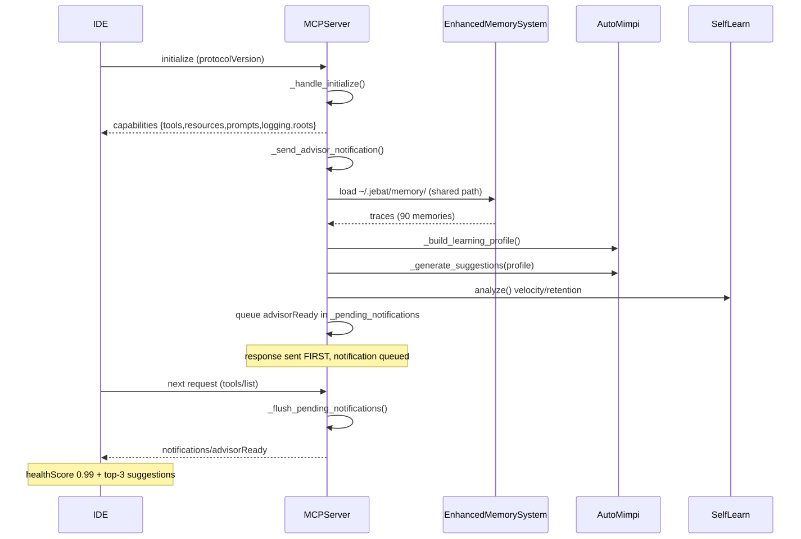
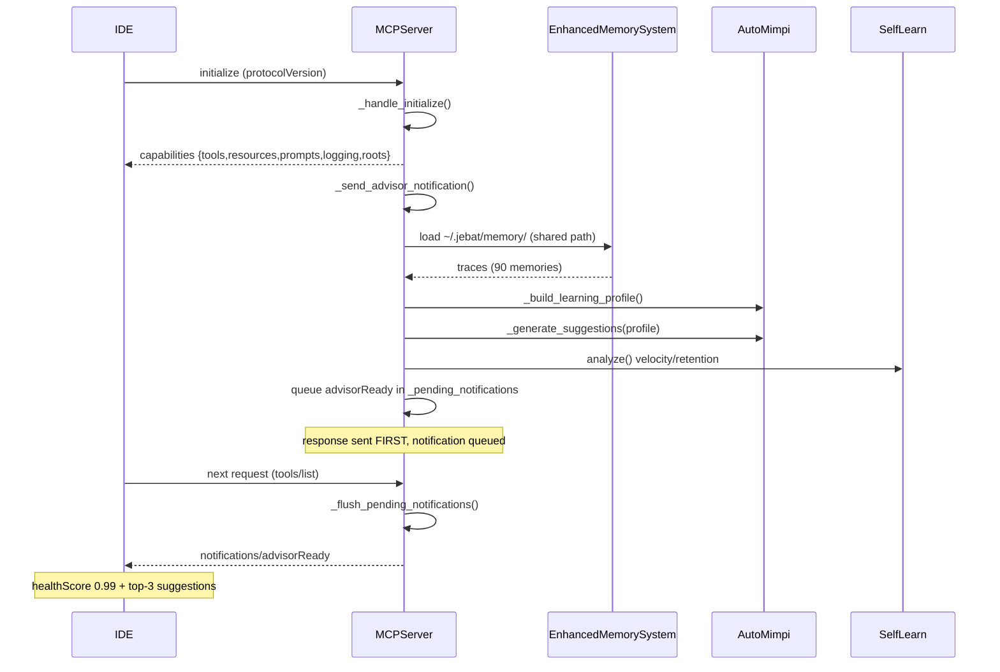
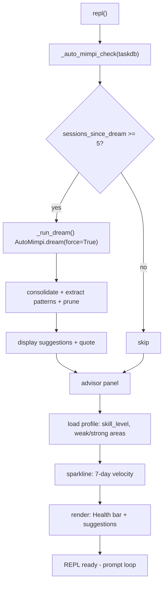
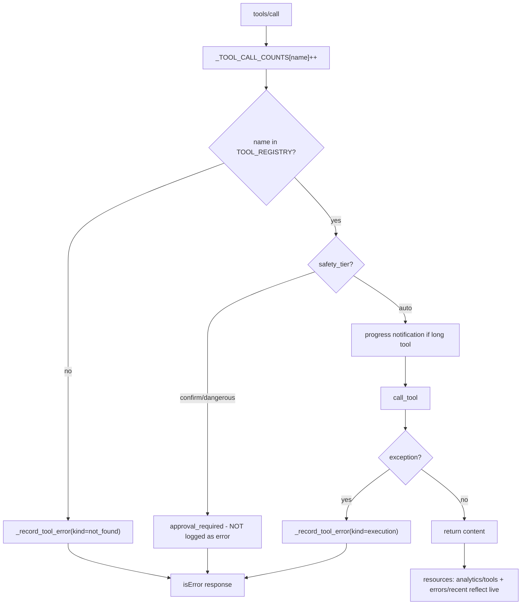
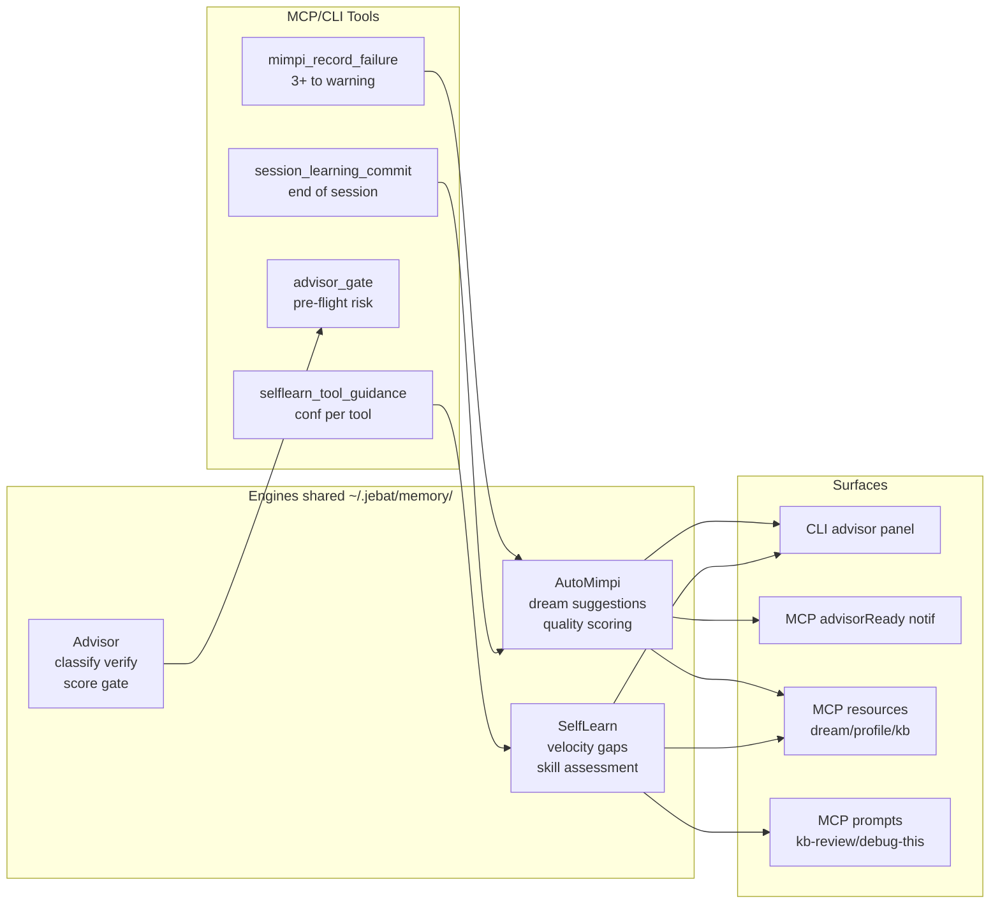
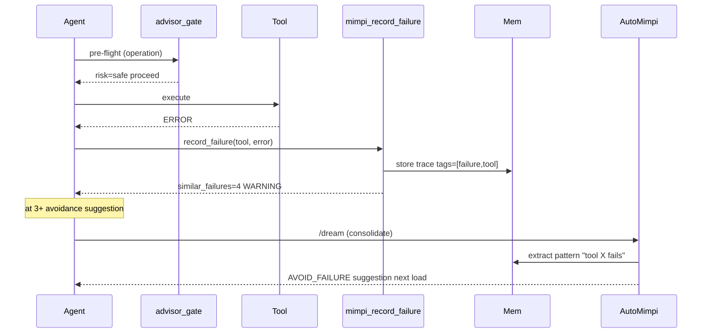
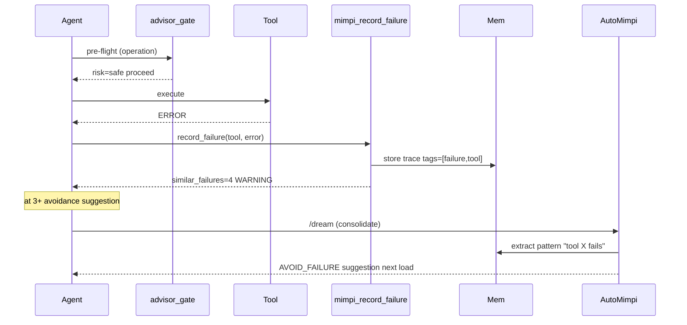

# JEBAT — MCP ↔ CLI Workflow Diagrams

Runtime flow of the Session Intelligence layer: how the three engines
(AutoMimpi, SelfLearn, Advisor) connect the MCP server and the CLI REPL.

> Images live in [`docs/diagrams/`](diagrams/). Editable Mermaid sources are
> the `.mmd` files; regenerate all SVG/PNG/PDF with
> `python scripts/render_diagrams.py`.

---

## 1. MCP Load-Time Flow (IDE connects)

`advisorReady` is **queued** during `initialize` and **flushed** on the next
dispatch — JSON-RPC cannot send a server notification before the initialize
response returns.





---

## 2. CLI Startup Flow (REPL boots)





---

## 3. Runtime Tool-Call Flow (the tracking spine)

Approval-required is a safety gate, **not** an error — only not-found and
execution exceptions reach `errors/recent`.





---

## 4. Session Intelligence Layer

The connective tissue: shared `~/.jebat/memory/` store feeds all three
engines; four tools write back into them.





---

## 5. Failure → Learning Loop

The end-to-end cycle that was previously missing: a tool fails → recorded →
at 3+ failures it warns → next `/dream` consolidates the pattern → next
session's `advisorReady` / CLI panel surfaces "Avoid: tool X".





---

## Assets

| File | Format | Use |
|------|--------|-----|
| `diagrams/0X-*.svg` | Vector | Best for README — scales, GitHub renders inline |
| `diagrams/0X-*.png` | Raster | Fallback where SVG is stripped |
| `diagrams/jebat-workflows.pdf` | Print | 5-page landscape, one diagram per page |
| `diagrams/0X-*.mmd` | Source | Edit and re-render |

**Regenerate everything:**

```bash
python scripts/render_diagrams.py
```

Requires `playwright` (Chromium) + `reportlab` + `Pillow`. Mermaid is cached
locally at `diagrams/mermaid.min.js` so rendering works offline.
