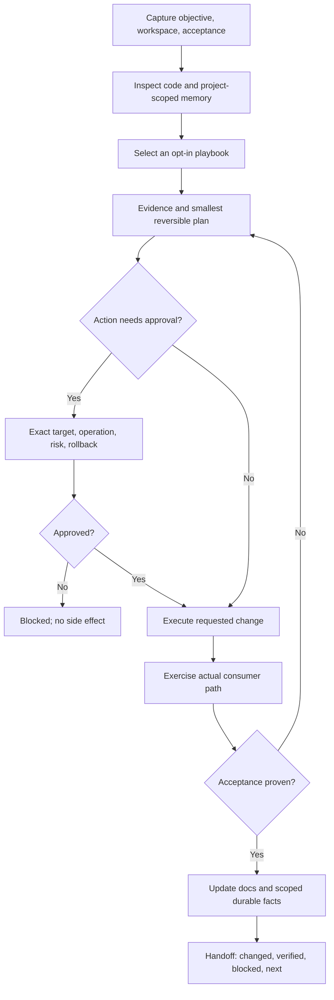

# JEBAT operating workflows

Updated 2026-10-07. Local implementation and verification, not a production-deployment claim.

## Operating contract

Main agent owns the task. No automatic delegation. If a subagent is necessary, explicitly select exactly the main agent's provider/model and stop rather than substitute an unavailable model. Existing Agentix teams remain opt-in; these playbooks do not launch them.

Use the current workspace's top-level source and capture records. Other checkouts and memory files are historical references, not authority for current code or health. Readiness must distinguish reachable, authentication-required, failed, and not checked.


```mermaid
flowchart TD
    A[Capture objective, workspace, acceptance] --> B[Inspect code and project-scoped memory]
    B --> C[Select an opt-in playbook]
    C --> D[Evidence and smallest reversible plan]
    D --> E{Action needs approval?}
    E -->|Yes| F[Exact target, operation, risk, rollback]
    F --> G{Approved?}
    G -->|No| H[Blocked; no side effect]
    G -->|Yes| I[Execute requested change]
    E -->|No| I
    I --> J[Exercise actual consumer path]
    J --> K{Acceptance proven?}
    K -->|No| D
    K -->|Yes| L[Update docs and scoped durable facts]
    L --> M[Handoff: changed, verified, blocked, next]
```

## Shared playbooks

Source of truth: `jebat/workflows.py`. CLI and MCP render the same policy and steps. Rendering is read-only guidance: no LLM call, agent spawn, scheduler activation, external send, or deployment.

| Playbook | Outcome |
|---|---|
| `plan-act-verify-remember` | Scoped implementation, runtime proof, durable memory |
| `workflow-audit` | Whole-path coverage and evidence-backed findings; no implied permission to modify |
| `quickwin-triage` | Ranked improvements with impact, risk, dependencies, acceptance, rollback |
| `spec-to-ship` | Observable feature acceptance through a complete vertical slice |
| `release-readiness` | Exact artifact, isolated checks, explicit deploy and rollback gates |
| `incident-response` | Evidence preservation, diagnosis, authorized containment, recovery proof |
| `dependency-upgrade` | Installed/target versions, current primary docs, compatibility and rollback |
| `automation-readiness` | Existing scheduler, repeat/overlap safety, paused activation gate |
| `session-handoff` | Continuation record distinguishing local, committed, deployed, and blocked |

```sh
jebat workflow list
jebat workflow list --json
jebat workflow show workflow-audit --task "Audit the operating path" --scope .
jebat workflow show quickwin-triage --task "Rank verified workflow improvements" --scope .
jebat workflow show release-readiness --task "Prepare this revision for release" --scope .
jebat workflow show session-handoff --task - --scope .
```

`--task -` reads stdin. `show --json` returns `{name, text}`. Empty/missing task or invalid workflow returns exit 2. Supply the rendered playbook to the current main agent; it is not an execution command.

MCP uses `prompts/list`, `prompts/get`, and `resources/read` for `jebat://workflow`. Example:

```json
{"jsonrpc":"2.0","id":1,"method":"prompts/get","params":{"name":"workflow-audit","arguments":{"task":"Audit the operating path","scope":"."}}}
```

Existing specialized prompts remain available: `project-onboard`, `debug-this`, `kb-review`, `hallmark-design-audit`, and `sales-copy-review`. Required arguments are validated; unknown names, wrong types, and missing arguments return JSON-RPC `-32602`. Terse discovery preserves optional arguments. `project-onboard` may read only a directory within the server workspace; resolved symlinks cannot escape it.

## Workflow surfaces and boundaries

| Surface | Authoritative implementation | Verified boundary / operating rule |
|---|---|---|
| Capture | `.vscode/jebat-workspace.json`, `PROJECT_START.md`, `BOOTSTRAP.md` | Start in the actual workspace; never infer current state from a sibling checkout |
| CLI | `jebat_cli_new/jebat.py`, `__main__.py` | `jebat`, `jebat repl`, `--continue`, and `--session ID` share restored context; module execution propagates exit codes |
| MCP | `jebat/features/mcp/mcp_server.py`, `mcp_prompts.py` | Actual stdio handshake and prompt errors exercised; mounted remote server connectivity is separate |
| Memory | `jebat/tools/automimpi_tools.py` | New facts carry project name and canonical root; recall/deletion enforce root when recorded; legacy unbound facts are flagged |
| Learning | `AutoMimpi`, `SelfLearn`, `LearningAdvisor`, `WikiStore` | Scoped consolidation, single-pass analysis, cited advice and reviewer feedback persisted in the existing SQLite KB |
| DAG tasks | `jebat/orchestration/workflow_engine.py` | Fresh state/results on each run, unique IDs, transitive skips, duplicate-task rejection, concurrent-run rejection, cancellation recovery |
| Agentix | `agentix.py`, `agentix_llm.py`, `agentix_team.py` | Existing explicit solution/team execution, registry, budgets, workspace and human gates; live model artifacts not validated in this audit |
| Scheduling | `jebat/features/cron/` | Existing subsystem retained; new automation playbook reviews readiness, does not enable jobs |
| CI/release | `.github/workflows/ci-cd.yml` | Main-branch manual dispatch can build before deploy; deployments reset/check the tested SHA, not moving `origin/main` |
| Handoff | Existing `memory/` and project memory | Capture verified facts and blockers; never copy secrets or claim fixture results as production proof |

### Memory and dream rules

- `project_recall` reports the MCP **server's** CWD, not automatically the IDE's project. Compare `project_root` before trusting it.
- New facts carry canonical `context.project_root`; separate same-named checkouts are isolated for rooted records. Legacy name-only facts remain visible and counted as `legacy_unbound_count`; assigning ownership requires review, not an automatic migration.
- Cross-project traces are excluded, not deleted or retagged. Previously mis-tagged facts need evidence-backed review before any correction.
- `session_learning_commit` writes its episodic summary and project-tagged semantic facts as one deduplicated batch. Repeated identical input retains IDs rather than fabricating new learning volume.
- CLI startup increments `sessions_since_dream`. Automatic consolidation requires at least five sessions and no prior dream or a dream at least 24 hours old. Invalid timestamps require review. `/dream` remains an explicit manual action.
- A failed dream retains the due counter and previous success timestamp. Only a successful engine run resets it. `~/.jebat/dream_state.json` is canonical; a workspace `.dream-state.json` is a mirror, not live proof.
- `jebat learning dream` / `mimpi_dream(force=false)` additionally respect the consolidation interval for the current project, restoring the last completed report from the KB after restart. `force` bypasses this interval, not project scope.
- The trace JSON file, canonical counter, workspace mirror, and SQLite report are separate commits. `status=partial` means consolidation succeeded but KB/mirror persistence failed; it does not mean rollback. Inspect the error before rerunning a forced cycle.

### Learning advisor and KB

The advisor is deterministic and evidence-backed, not another LLM or delegated agent. It prioritizes clock anomalies, low-confidence facts, recurring failures, weak/stale evidence, and unlinked memories. Each recommendation has a stable evidence-versioned record ID, supporting memory IDs/timestamps, and a review requirement. Retention/coverage metrics are explicitly **not measured task competence**.

```sh
jebat learning analyze
jebat learning advise --focus terminal --limit 5
jebat learning dream
jebat learning status
jebat learning search "AutoMimpi" --kind dream
jebat learning search "terminal" --kind advice
jebat learning feedback RECORD_ID helpful --evidence "Rechecked the cited source and confirmed the recommendation"
```

Use an actual `record_id` returned by `advise` or `search`. CLI commands emit JSON. `feedback` is an explicit reviewer action; MCP exposes the same action as a CONFIRM tool. `unhelpful` / `dismissed` suppress that evidence version; `helpful` restores visibility. Neither response edits facts, inflates confidence, grants permissions, or executes the proposed action.

MCP tools: `learning_advisor`, `learning_feedback`, `learning_kb_search`, `learning_kb_status`, alongside the existing `selflearn_analyze`, `mimpi_dream`, `mimpi_record_failure`, and `session_learning_commit`. Resources: `jebat://learning/profile`, `jebat://learning/advisor`, `jebat://kb/learning`; `jebat://memory/dream` includes the latest persisted project report. CLI startup and MCP `advisorReady` use this same scoped analysis.

Storage: existing `~/.jebat/wiki/index.db`, or `JEBAT_WIKI_DIR/index.db`. Additive tables `learning_records`, `learning_feedback`, and FTS5 `learning_fts`; existing pages/backlinks retained. Records and feedback require canonical project root. Full-text terms are tokenized and bound as SQL parameters. No new DB service, embeddings dependency, generated wiki pages, or production migration.

Optimization and correctness:
- SelfLearn calculates strength once per selected trace; profiles reuse its result. Metadata tags do not become skills. Naive legacy timestamps are interpreted as UTC; future-dated creation does not increase recent-learning velocity.
- Clustering precomputes text n-grams; project/root groups cannot merge. Source IDs prevent repeated generalization/pattern duplication. New patterns use surviving evidence only; pruning cleans associated IDs.
- Identical observed failures have separate event IDs so reload deduplication does not erase recurrence. Repeated facts still deduplicate.
- Recognizable credential patterns are redacted before recording new facts, failures, and feedback. This is best-effort hygiene, not a secrets detector: callers must never submit secrets or unnecessary personal data.
- Existing memory remains JSON-backed. The in-process dream lock is not a cross-process transaction/lock; concurrent CLI/MCP writers to the shared JSON store are not proven safe. Large-store clustering remains quadratic despite cheaper comparisons. No measured wall-clock speedup is claimed.

Verification: `python scripts/check_learning.py` passed against disposable HOME/USERPROFILE, memory, and SQLite. It exercises real CLI/MCP, source isolation, restart behavior, feedback approvals, repeated failures, duplicate dreams, clock handling, FTS integrity, and persistence failure reporting. Existing focused learning/memory/wiki/MCP suite: **75 passed**. `scripts/check_workflows.py` also passed after integration. No real user-memory consolidation or production deployment was performed.

### Execution limits

The DAG engine is in-memory, not durable job scheduling. A synchronous callable runs in a thread: timeout/cancellation stops awaiting it but cannot kill its underlying side effects. Use subprocess/service isolation for hard termination of side-effecting work. Retry fields do not establish an exactly-once or retry guarantee.

`jebat doctor` checks Agentix registry/build state; it is not an API, MCP, credential, or deployed-revision health check. `jebat status` reports local inventory, not live service health.

A WebUI HTTP 200 proves its shell is served, not authenticated API or interactive success. HTTP 401/403 means authentication-gated, not healthy or down. Release readiness must verify a changed behavior and exact revision after authorized deployment.

## Confirmed audit fixes

| Finding | Evidence before change | Correction |
|---|---|---|
| Cross-project recall/deletion | Foreign trace returned while a different project was active | Matching project tags required; deletion rejects foreign IDs |
| Lost handoff knowledge | Committed key fact returned zero project recall results | Key facts stored with project/category tags |
| False session resume | CLI printed “Resumed 2 messages”; saved continuation contained only new shell output | Pass restored agent into the real REPL |
| Undiscoverable manual saves | `/session` writer omitted the `session_` prefix used by readers | Consistent filenames, sub-second timestamps, missing-session errors |
| Swallowed CLI failures | Actual `python -m jebat_cli_new` returned 0 for failed resume | `__main__` raises `SystemExit(main())` |
| False dream success | Failed cycle increased dream count and reset due state | Engine-only success accounting plus 24-hour cooldown |
| Hidden advisor failure | Startup referenced an unimported `timezone` | Import UTC helpers |
| Broken repeat DAG runs | First run succeeded; second failed as a deadlock | Reset task state, preserve independent result snapshots |
| Incomplete DAG terminal state | Only immediate failed descendants marked skipped; duplicate IDs replaced tasks | Transitive skip closure, unique IDs, duplicate and running guards |
| Permissive MCP prompts | Missing task/unknown prompt accepted; terse mode hid `scope` | Input validation and standard protocol errors |
| Onboarding scope escape | Outside workspace README returned via `project-onboard` | Root and symlink confinement; bounded excerpt reads |
| Authenticated HTTP crash | Actual legacy `/message` returned 500: undefined `hmac` | Import constant-time comparison; verify missing key 401 and correct key 200 |
| Broken HTTP notification stream | `EventSourceResponse` used as an async context manager instead of an ASGI response | Return async-generator response; deliver endpoint and queued notifications |
| Unreadable recovery log | `jebat://errors/recent` failed slicing a deque | Snapshot queue to a list before selecting recent errors |
| CLI recall/commit failures | Recall sliced set tags; `/commit` crashed on undefined `tool_terminal` | Stable sorted tags; argument-array Git commands preserve quoted commit messages |
| Manual release dependency dead-end | Deploy required manual dispatch; prerequisite build allowed only push | Align main-branch trigger conditions |
| Release revision drift | Log printed tested SHA while reset used moving `origin/main` | Fetch/reset/check exact workflow SHA |
| Private-home-dependent test | Clean home had no `skill://tokguru/` fixture | Isolated configured skill and exact content round-trip |

## Recommended next quick wins

These are recommendations, not additional features claimed as delivered.

| Priority | Improvement | Evidence and benefit | Size / prerequisite | Acceptance |
|---|---|---|---|---|
| 1 | Restore authenticated mounted MCP | Remote `project_recall`/`mimpi_status` returned “MCP server not connected”; local stdio works | Small; transport/config credentials, explicit config permission | Initialize + project recall from intended root without secrets in logs |
| 2 | Verify team artifact freshness | `verify_leg` accepts an existing filename across workspace/solution/CWD; existence alone cannot prove this run produced it | Small/medium; run-scoped artifact contract | Stale artifact rejected; current run's required artifact accepted |
| 3 | Separate release reachability from readiness | CI production probe checks only WebUI HTTP success | Small; authenticated probe and verified production route | Exact SHA plus changed API/UI behavior; authentication gates reported honestly |
| 4 | Make tool-command failures machine-readable | `tool_command.py` returns 0 after string results, including bridge errors | Medium; structured result contract across all callers | Unknown, cancelled, execution-error, and success produce distinct usable outcomes |
| 5 | Bind reviewed legacy facts to canonical roots | New rooted facts are isolated; old name-only records cannot identify a checkout reliably | Medium; explicit migration and conflict policy | Review legacy ownership without losing or silently retagging evidence |
| 6 | Reproducible local verification command | Project `.venv` lacks pytest; installed Python 3.12 has the required runner | Small; standardize the existing dev environment, no new framework | Fresh environment runs the documented smoke and focused suite |

Avoid new agent teams, a new scheduler, or automatic deployment until the existing path's recovery and approval boundaries are proven. More unattended execution would amplify current operational gaps.

## Verification

Runnable, isolated check left in the repository:

```sh
python scripts/check_workflows.py
```

No test framework required. Application dependencies are required. The check launches a child with temporary `HOME` **and** `USERPROFILE`, asserts the redirected home, uses temporary memory/workspace state, launches the real CLI and stdio MCP, then removes the sandbox. No model calls, external delivery, production reads/writes, or deployment.

Observed: all smoke groups passed: project recall/deletion/handoff persistence; DAG rerun/failure/cancellation; dream failure/cooldown/success; actual CLI resume/continue/manual-save/error codes, recall, and literal quoted commits; actual MCP catalog/error/scope checks and CLI/MCP playbook parity; local authenticated legacy HTTP 401/200, SSE endpoint, and real notification delivery.

CI configuration: parsed YAML, exercised main-push/main-dispatch/PR/other-branch trigger matrix, and checked deployment shell syntax without executing SSH. Local inventory commands `status`, `doctor`, `agentix templates`, and `agentix teams` exited 0 in the sandbox.

Focused existing suite: **48 passed**, using installed Python 3.12 with isolated home:

```sh
py -3.12 -m pytest -q tests/test_orchestration_workflow_engine.py tests/test_dream_state.py tests/test_mcp_protocol_surface.py tests/test_cli_new_entrypoint.py tests/test_cli_args.py tests/test_config_import.py
```

Use disposable home variables for memory-writing tests. Remote MCP, live model execution, production deployment, and hosted CI execution were not verified. CI edits are local workflow configuration, not evidence of a successful release.
Language-server checks are clean for the shared catalog, workflow command, DAG engine, and smoke script. Existing CLI/MCP/memory modules still report legacy typing/import diagnostics outside these fixes; no whole-repository type-clean claim.

## Current primary reference

MCP 2026-07-28 [prompt contract and error handling](https://modelcontextprotocol.io/specification/2026-07-28/server/prompts) and [schema](https://modelcontextprotocol.io/specification/2026-07-28/schema), consulted 2026-10-07. Keep prompts user-selected; validate inputs; return `-32602` for invalid names/arguments. No protocol downgrade or speculative transport rewrite.
SSE response lifetime follows the existing transport pattern and the primary [sse-starlette documentation](https://github.com/sysid/sse-starlette/blob/main/README.md): return `EventSourceResponse` over an async generator, not an async context manager.

Older `docs/diagrams/` assets and earlier audit reports are historical snapshots. Their hardcoded counts, health scores, and completion labels are not current runtime evidence; this runbook supersedes their operating guidance.
